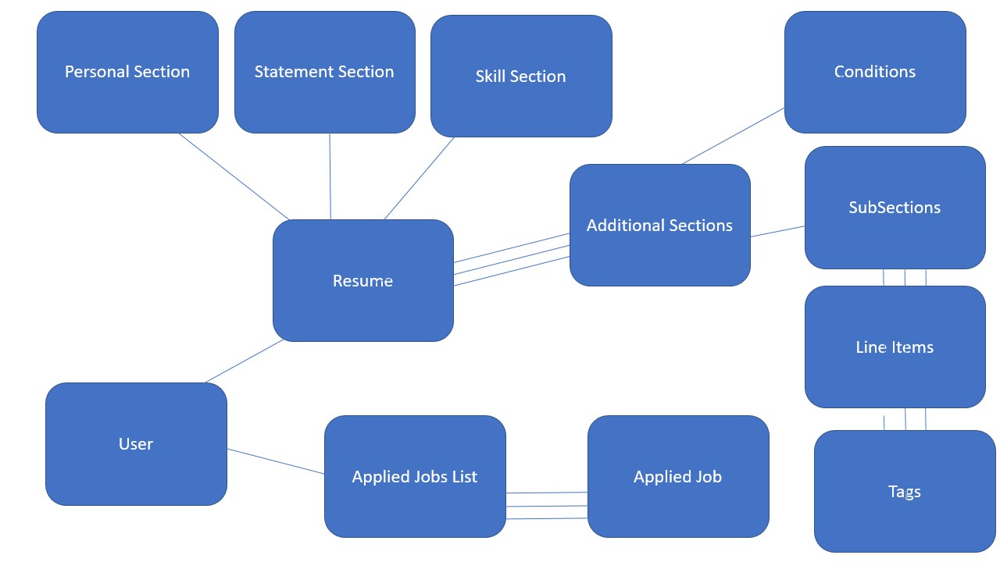

# Align
The app, Align, is a job agent that searches for jobs for a user based on the user's skillset. It tracks the jobs you applied to and optimizes your resume for each job, so that you can be a standout candidate every time.

# Deployment Link and Trello
* https://align-jobs.herokuapp.com/
* https://trello.com/b/xnZEOPmH/easy-hunt

# User Story
* As a user, I don't want to search for jobs. I want my agent to present me with jobs that a good fit for my skillset.
* As a user, I don't want to customize my application materials. I want my agent to customize them and present them back to me for approval.
* As a user, I don't want to track which jobs I applied to, my agent should keep all my records.

# High Level Overview
* Our application helps job seekers not only find jobs, but tailor’s their application materials specifically for those jobs with the click of a button.
* We pull key words out of the job post and compare those against the contents of an extended resume. Then we select the best fitting lines within the extended resume and condense it to an ATS optimized 1 page resume. Users can download that resume as a .docx file and submit it directly to that particular job via the link we provide.

# Wireframes

# Technologies Used
* HTML
* CSS
* Tailwind CSS
* JavaScript
* docx library
* React.js
* Remotive API
* Express
* Node.js
* MongoDB Atlas
* Mongoose
* Heroku

# ERD

# Icebox
* Coverletter Autofill
* Indeed search
* Tag scan of Indeed posts
* View resume while building/editing
* Download Resume as PDF
* Mobile responsive